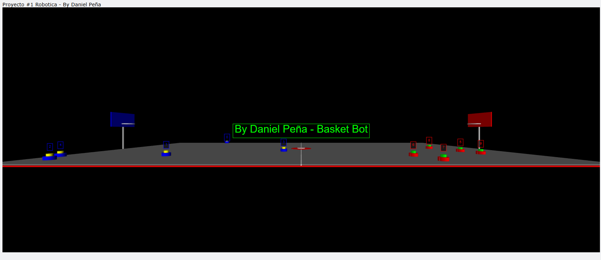
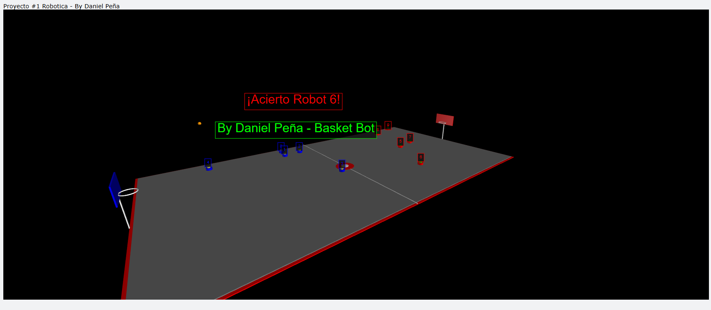

# Proyecto Basket Bot – Simulación de Robots en Cancha de Basketball

Este proyecto simula una cancha de basketball con múltiples robots que se mueven aleatoriamente y lanzan pelotas hacia el aro, todo en un entorno 3D interactivo desarrollado con **VPython**.

---

## Autor

- **Daniel Peña**
- Estudiante de Ingeniería Civil Informática
- Universidad Católica de Temuco

---

## Descripción del Proyecto

Este simulador recrea una cancha de basketball 3D con 10 robots (5 por equipo) que:

- Se desplazan de manera autónoma dentro de su mitad de cancha.
- Lanzan balones periódicamente hacia el aro contrario.
- Calculan la trayectoria de la pelota considerando física realista (gravedad, ángulo, velocidad).
- Detectan automáticamente si el balón entra al aro y muestran un mensaje de anotación.

---

## Funcionalidades

- 🏀 **Simulación en tiempo real de robots móviles.**  
- 🎯 **Cálculo dinámico de trayectorias para lanzamientos al aro.**  
- 📌 **Detección de aciertos y visualización gráfica del resultado.**  
- ⚙️ **Modelado físico de velocidad, gravedad y ángulos de disparo.**  
- 🧠 **Robots con movimiento aleatorio y decisiones automáticas.**  

---

## Requisitos

- Python 3.7+
- VPython

### Instalación

```bash
pip install vpython

```
## Imagenes de la simulacion:


